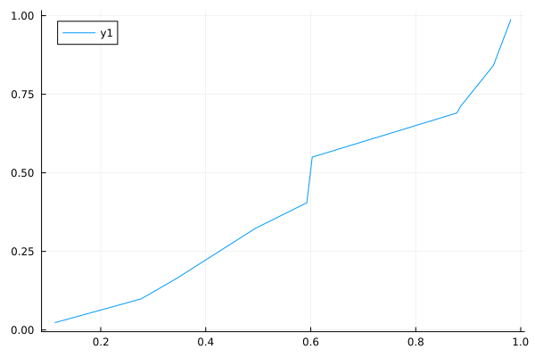
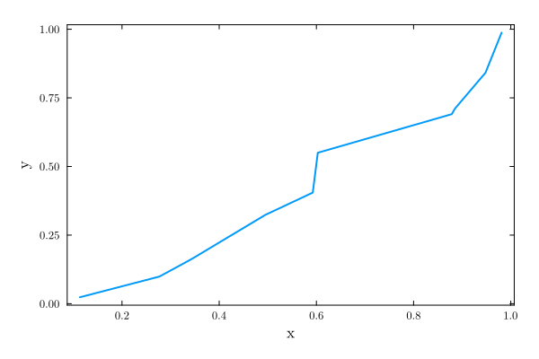

# Plotting style

This package provides a simple type to overload the default plotting styles of `Plots`, such
figures that are prettier (in our oppinion) are produced. To use the style, add `MolSimStyle`
as the first argument of the plotting functions. 

In brief, use the `Plots` plotting functions with, for example:

```julia
plot(MolSimStyle, x, y, xlabel = "my x")

histogram(MolSimStyle, x)

contourf(MolSimStyle, M, xlabel = "my x", ylabel = "my z")
```

by adding the first argument to the available plotting functions. 

## Without the style

For example, **without** the style:

```julia-repl
julia> using MolSimToolkit, Plots

julia> x = sort(rand(10)); y = sort(rand(10));

julia> plot(x,y)
```

produces:



## With the style

Now, **with the style**, we get:

```julia-repl
julia> plot(MolSimStyle, x, y)
```



All other normal parameters of `Plots` function can be used to change the plot labels,
titles, legends, font sizes, etc.

!!! tip 
    In v1.21.2, if if setting `font_family="Serif"`, LaTeXStrings will be converted to `\mathsf`
    to match the overall plot fonts. This behavior can be disabled with `adjust_latex_font=false`. 

## Available plotting functions

The `Plots` functions that are overloaded are:

```julia
Plots.plot
Plots.plot!
Plots.scatter
Plots.scatter!
Plots.histogram
Plots.histogram!
Plots.contour
Plots.contour!
Plots.contourf
Plots.contourf!
Plots.annotate!
```

## The `annotate!` function

The `annotate!` function is special, because the overload does not have the 
same level of flexibilty of the standard `Plots.annotate!` function. Here, it
is used with

```julia-repl
julia> using MolSimToolkit, Plots

julia> x = sort(rand(10)); y = sort(rand(10));

julia> plot(MolSimStyle, x, y)

julia> annotate!(MolSimStyle, 0.7, 0.3, "My note!"; fontsize = 12)
```

where `7.0` and `3.0` are the coordinates. This will produce:


!!! warning
    These styles and methods can be changed without introducing
    breaking changes in the package version. 


