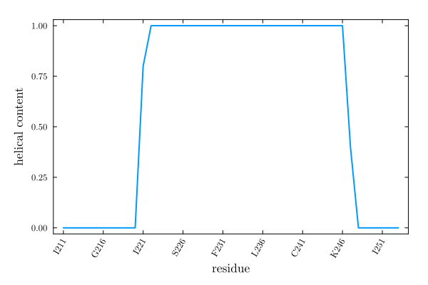

```@meta
CollapsedDocStrings = true
```
# Secondary structures

This package provides convenience functions to analyze the protein secondary structure along
molecular dynamics simulations. 

## Secondary structure map

The secondary structure map is the profile of the secondary structure computed for 
each frame of the trajectory. This computation may be costly, particularly with the 
DSSP algorithm, so it is recommended to save the result. See [Saving and loading a map](@ref)
for further information. 

```@docs
ss_map
```

A complete example for computing a secondary structure map is shown below:

```jldoctest
julia> using MolSimToolkit, MolSimToolkit.Testing

julia> simulation = Simulation(Testing.namd_pdb, Testing.namd_traj);

julia> ssmap = ss_map(simulation; selection="residue >= 30 and residue <= 35", show_progress=false)
6×5 Matrix{Int64}:
 5  9  5  5  5
 5  9  5  5  5
 5  1  5  5  5
 5  1  5  5  5
 5  1  5  5  5
 9  9  9  9  9

```

Here we have computed the secondary structure map for 6 residues of the structure, along the
5 frames of the trajectory. The resulting map is a matrix, where each code represents 
a different class of secondary structure. The conversion between representations of 
the classes can be done with these three functions of the [ProteinSecondaryStructures.jl](https://github.com/m3g/ProteinSecondaryStructures.jl) package,
which are reexported here:

- `ss_code`: convert the representation to one-letter codes like `H`, `B`, `C`, etc.
- `ss_name`: convert the representation to secondary structure names like `Alpha-helix`, `Beta-bridge`, etc.
- `ss_number`: convert the representation to code numbers, like the ones used the matrix above. 

The list of classes and code associations of is available 
[here, in the ProteinSecondaryStructures.jl documentation](https://BioJulia.dev/ProteinSecondaryStructures.jl/stable/overview/#Secondary-structure-classes).

For example, considering the secondary structure map matrix above, we can do:

```julia-repl
julia> ss_name.(ssmap)
6×5 Matrix{String}:
 "turn"  "coil"       "turn"  "turn"  "turn"
 "turn"  "coil"       "turn"  "turn"  "turn"
 "turn"  "310 helix"  "turn"  "turn"  "turn"
 "turn"  "310 helix"  "turn"  "turn"  "turn"
 "turn"  "310 helix"  "turn"  "turn"  "turn"
 "coil"  "coil"       "coil"  "coil"  "coil"

```

## Calculation methods: STRIDE and DSSP

The STRIDE or DSSP methods can be used to compute the secondary structure. STRIDE is faster,
and DSSP is the default method used in the Protein Data Bank. The method is chosen with the
`method` keyword of `ss_map`:

```julia
ssmap = ss_map(atoms, trajectory; method=stride_run)
ssmap = ss_map(atoms, trajectory; method=dssp_run)
```

## Plotting the map

The `ss_heatmap` function provides a convenient tool to plot the secondary
structure along the trajectory:

```@docs
ss_heatmap
```

!!! note
    This function requires loading the `Plots` package, and `residue_ticks` is
    provided by `PDBTools`. 

For example:


```julia-repl
julia> using MolSimToolkit, MolSimToolkit.Testing

julia> using Plots, PDBTools

julia> simulation = Simulation(Testing.namd_pdb, Testing.namd_traj);

julia> ssmap = ss_map(simulation; ss_method=stride_run, show_progress=false);

julia> protein = select(atoms(simulation), "protein");

julia> ss_heatmap(ssmap; scalex=0.1, xlabel="time / ns", yticks=residue_ticks(prot; stride=5))
```

The above code will produce the following plot, which can be saved with `savefig("plot.svg")`:


## Saving and loading a map

The secondary structure map computed is just a matrix of integer codes. Thus, it can be saved or read in any preferred format.
As a suggestion, it is possible to use `writedlm` and `readdlm` function from the `DelimitedFiles` package: 

```julia
using DelimitedFiles
# save data to ssmap.dat
writedlm("ssmap.dat", ssmap)
# load data
ssmat = readdlm("ssmap.dat", Int)
```

## Average structure of each class

From a precomputed secondary structure map the `ss_mean` helper functions
will provide the content of a specific call of secondary structure along the simulation:

```@docs
ss_mean
```

For example, given the `ssmap` matrix of the examples above, compute the average
content of alpha-helices with:
```julia-repl
julia> ss_mean(ssmap; class="H")
0.6093023255813953
```

The average content per frame is computed by averaging over the first dimension
of the matrix (the residues):

```julia-repl
julia> h = ss_mean(ssmap; class="H", dims=1)
5-element Vector{Float64}:
 0.627906976744186
 0.627906976744186
 0.5813953488372093
 0.6046511627906976
 0.6046511627906976
```

Which can be plotted with:

```julia-repl
julia> plot(MolSimStyle, h, 
           xlabel="frame", 
           ylabel="helical content"
       )
```

producing the time-dependence plot of the helical content:


## Average structure per residue

And the average content per residue is obtained by averaging over the frames, 
that is, the columns of the matrix:

```julia-repl
julia> h = ss_mean(ssmap; class="H", dims=2)
43-element Vector{Float64}:
 0.0
 0.0
 0.0
 ⋮
 1.0
 0.4
 0.0
```

This can be plotted, for example, with:

```julia-repl
julia> using Plots, PDBTools

julia> ticks = residue_ticks(select(atoms(simulation), "protein"); stride=5)
(1:5:41, ["I211", "G216", "I221", "S226", "F231", "L236", "C241", "K246", "I251"])

julia> plot(MolSimStyle, h, 
           xlabel="residue", xticks=ticks, xrotation=60,
           ylabel="helical content"
       )
```

Which will generate the following figure:



